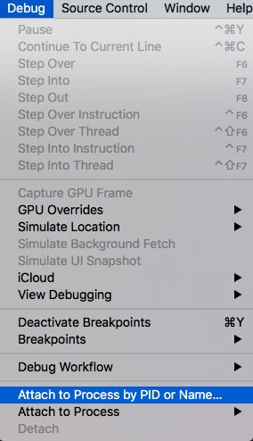
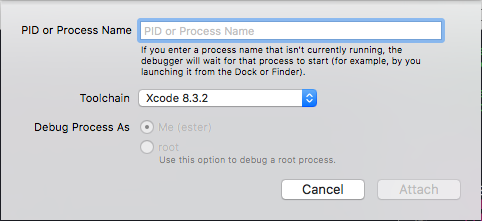

# Debugging push notifications when the app is killed

There is a way to debug push notifications even when the app is killed (so the process is not running therefor the debugger won't be attached normally).

You can do that by killing the app (stopping it from running from Xcode). Then go to *Debug -> Attach to process by PID or Name...* and filling up the process name or PID of your app.

After this is setted up XCode will wait for your process to start. Trigger then your push notification and you'll be able to debug all the push flow (handle notification, etc).

