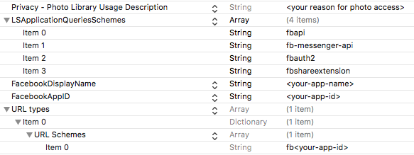

#Installing Facebook Swift SDK

## Install the pods (Cocoapods)[^1]

Add this lines to your pod files:

[^1]: If you don't use Cocoapods then just download the SDK and set it up in your project as with any other framework.
 

```ruby
use_frameworks!

pod 'FacebookCore'
pod 'FacebookLogin'
pod 'FacebookShare'

```

> Use the pods that you need in your project. No need to put the three of them.

[Oficial Documentation](https://developers.facebook.com/docs/swift/getting-started)

## Create the Facebook App

First create an App in the [Facebook developer site](http://developers.facebook.com/apps).

Once created, check in the left panel and click on `Add a product` and `Login with Facebook`. Then you need to configure that product. You'll see some settings that by default are off. You need to turn on this two: 

> oAuth client access
> 
> oAuth web access

The rest of the settings must be unchanged (off by default). Leave also those URI text fields empty (since you are not making a website those are not needed)

After this, we need to configure the newly created app.


## Configure the Facebook App


There is a quick configuration link available (as of Jan 2017) [here](https://developers.facebook.com/quickstarts/?platform=ios)

But if you want to do it manually what you need to do is to enter the Bundle Identifier in the Facebook app configuration. 

Go to your [Facebook app](https://developers.facebook.com/apps) (if you were not there from the previous step) and click on `Configuration`.  There you will find the App ID, secret key, name and such. 
Scroll down and click in the `Add platform` button. Select iOS and add your bundle identifier there. 

For now that's all you need to enter in that configuration (leave the rest empty/off or with the default values).


## Configure your iOS App (in XCode)

### Info.plis keys

Open your `Info.plist` file and insert the folowing keys: 



>For the `Privacy - Photo Library Usage Description` the key is `NSPhotoLibraryUsageDescription`
>
>For the `URL Types+` the key is `CFBundleURLTypes`. 

It is faster to copy paste the above keys than search for them in the dropdown menu.

You only need the `Privacy - Photo Library Usage Description` setting if you are going to use the camara in your app.

### AppDelegate

Add these code in the `AppDelegate.swift`:

```swift
	func application(_ application: UIApplication, didFinishLaunchingWithOptions launchOptions: [UIApplicationLaunchOptionsKey: Any]?) -> Bool {
   		// Override point for customization after application launch.
   	  	// Your other code goes here
        
     	// Facebook SDK
      	SDKApplicationDelegate.shared.application(application, didFinishLaunchingWithOptions: launchOptions)
        
   		return true
   	}

    func application(_ app: UIApplication, open url: URL, options: [UIApplicationOpenURLOptionsKey : Any] = [:]) -> Bool {
        return SDKApplicationDelegate.shared.application(app, open: url, options: options)
    }
```


## Try Login with facebook 

Now that everything is set up, you can try if your configuration is correct by using a Facebook Login button. Add this code to any view controller and try that you can login with facebook: 

```swift
import FacebookLogin

func viewDidLoad() {
	let loginButton = LoginButton(readPermissions: [.publicProfile])
	loginButton.center = view.center 
	// You can also add your own constraints instead of this quick-and-dirty way to center the button
	view.addSubview(loginButton)
}
```

If everything is fine you should see the login button, and it will bring you through the login sequence (outside of your app) if you tap on it. Once logged in the title of the button will change to "Log out". 


